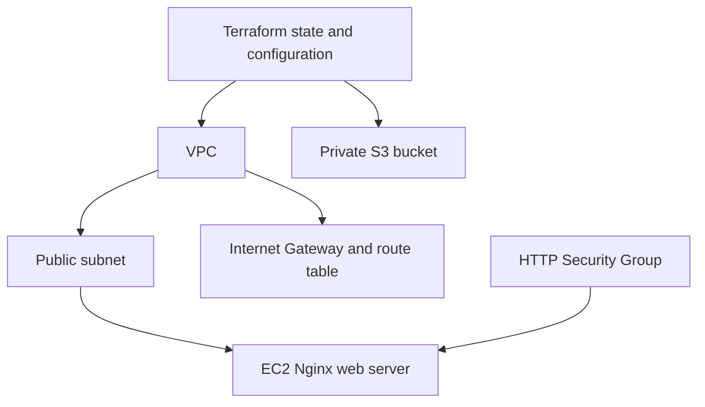

# Session 19: Cloud and Terraform in Action

**Nitish Kumar Bhambu — 24BCS10589**

The [AWS project](aws/) creates a VPC, public subnet, Internet Gateway, routes, HTTP Security Group, an EC2 web server and a private S3 bucket. AMI lookup uses the Amazon Linux public SSM parameter. SSH is not opened. Resource references connect the dependency graph; the web VM waits for its subnet route association.



Copy terraform.tfvars.example to a local tfvars file, choose a unique bucket name, then run the workflow below. HTTP installation via user_data is asynchronous; a created VM does not by itself prove the web server is ready. Verify the output URL with curl after boot.

```bash
terraform init
terraform fmt
terraform validate
terraform plan -out=tfplan
terraform apply tfplan
terraform show
terraform output
# After collecting evidence and confirming resources are no longer needed:
terraform plan -destroy -out=tfplan
terraform apply tfplan
```

The final two commands execute a reviewed destroy plan. `terraform destroy` is the interactive shortcut for that destruction workflow. Do not apply or destroy a different person's state. State records resource identities and can include secrets; it is ignored here. References between resource attributes express dependencies, and Terraform orders operations from that graph.
## Azure alternative

[azure-alternative/](azure-alternative/) prepares a resource group, VNet, subnet, Network Security Group and private storage account. It is not claimed as an AWS exercise, and it currently does not include an Azure VM or AKS. Azure CLI reports an enabled subscription locally, but instructor approval of the substitution is still unknown. Neither cloud project has been applied during this review.

[Azure Portal and CLI setup](../docs/AZURE-SETUP.md) · [AWS validation](aws/validation.txt) · [Azure validation](azure-alternative/validation.txt)
