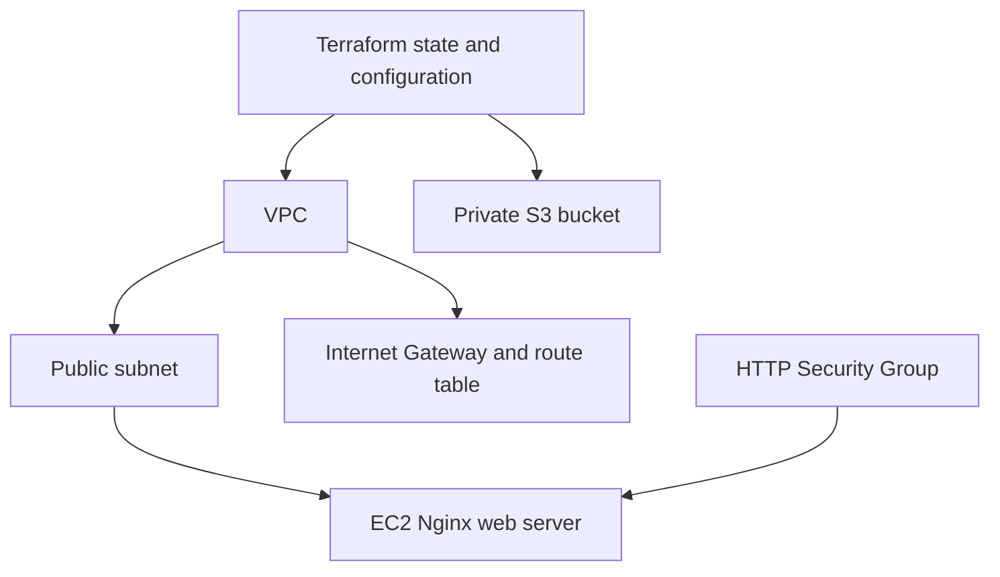
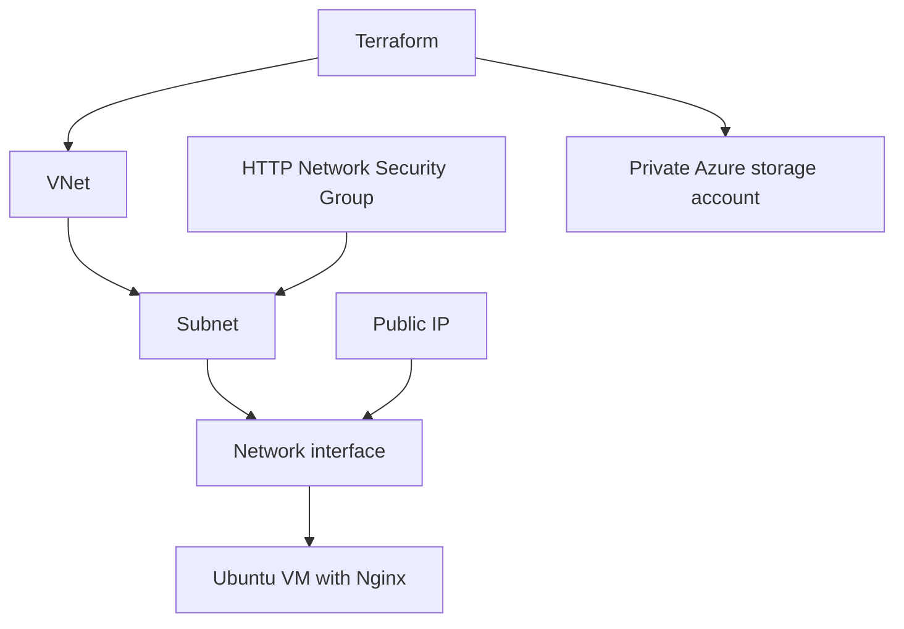

# Session 19: Cloud and Terraform in Action

**Nitish Kumar Bhambu — 24BCS10589**

The [AWS project](aws/) creates a VPC, public subnet, Internet Gateway, routes, HTTP Security Group, an EC2 web server and a private S3 bucket. AMI lookup uses the Amazon Linux public SSM parameter. SSH is not opened. Resource references connect the dependency graph; the web VM waits for its subnet route association.



Copy terraform.tfvars.example to a local tfvars file, choose a unique bucket name, then run the workflow below. HTTP installation via user_data is asynchronous; a created VM does not by itself prove the web server is ready. Verify the output URL with curl after boot.

```bash
cd 18-cloud-terraform/aws
terraform init
terraform fmt
terraform validate
terraform plan -out=tfplan
terraform apply tfplan
terraform show
terraform output
# After collecting evidence and confirming resources are no longer needed:
terraform plan -destroy -out=tfplan
terraform apply tfplan
```

State tracks the created resources and stays out of Git. Resource references tell Terraform the order to create or remove them.
## Azure alternative

[azure-alternative/](azure-alternative/) was applied against the real Azure for Students subscription in Central India. It created a VNet, subnet, Network Security Group, HTTP rule, network interface, public IP, Ubuntu VM and private storage account. Cloud-init installed Nginx, and curl returned `Hello World from Terraform on Azure`. All nine Terraform-managed resources were then destroyed; the state list was empty.

The initial B1s request failed because that size had no available capacity. The successful run used Standard_D2s_v3. Storage polling initially failed because shared-key authentication was disabled; enabling the provider's Entra authentication and granting Blob Data Contributor fixed it. These failures and the successful recovery are retained in the command blocks.

The resource group was a shared bootstrap dependency for these coursework exercises; it was deleted after the final AKS lab. The AWS project was validated but was not applied. Azure is an explicit substitute and instructor acceptance is still unknown.



The command blocks below show provisioning, HTTP verification and cleanup. The AWS configuration passed local validation; it was not deployed.

### Cloud infrastructure and HTTP verification

```bash
zephoryx@fedora$ az group create --name rg-devops-homework --location centralindia --tags purpose=devops-homework --query '{name:name,location:location,provisioningState:properties.provisioningState}' -o json
{
  "location": "centralindia",
  "name": "rg-devops-homework",
  "provisioningState": "Succeeded"
}

zephoryx@fedora$ cd 18-cloud-terraform/azure-alternative

zephoryx@fedora$ terraform init
Initializing the backend...

Initializing provider plugins...
- Reusing previous version of hashicorp/azurerm from the dependency lock file
- Using previously-installed hashicorp/azurerm v4.81.0

Terraform has been successfully initialized!

zephoryx@fedora$ terraform fmt -check

zephoryx@fedora$ terraform validate
Success! The configuration is valid.

zephoryx@fedora$ terraform plan -out=lab.tfplan
data.azurerm_resource_group.lab: Reading...
data.azurerm_resource_group.lab: Read complete after 2s [id=/subscriptions/<subscription-id>/resourceGroups/rg-devops-homework]

Terraform used the selected providers to generate the following execution
plan. Resource actions are indicated with the following symbols:
  + create
# ... intermediate output omitted ...

Plan: 9 to add, 0 to change, 0 to destroy.

Changes to Outputs:
  + resource_group  = "rg-devops-homework"
  + storage_account = "nitishhw1791379309"
  + vnet_id         = (known after apply)
  + web_url         = (known after apply)

zephoryx@fedora$ terraform apply lab.tfplan
azurerm_network_security_group.app: Creating...
azurerm_virtual_network.lab: Creating...
azurerm_public_ip.web[0]: Creating...
azurerm_storage_account.lab: Creating...
# ... output shortened ...
Error: waiting for the Data Plane for Storage Account (Subscription: "<subscription-id>"
# ... output shortened ...
Error: creating Linux Virtual Machine (Subscription: "<subscription-id>"
# ... output shortened ...
  on vm.tf line 35, in resource "azurerm_linux_virtual_machine" "web":
  35: resource "azurerm_linux_virtual_machine" "web" {

# Exit status: 1

zephoryx@fedora$ az group create --name rg-devops-homework --location centralindia --tags purpose=devops-homework --query '{name:name,location:location,provisioningState:properties.provisioningState}' -o json
{
  "location": "centralindia",
  "name": "rg-devops-homework",
  "provisioningState": "Succeeded"
}

zephoryx@fedora$ terraform init
Initializing the backend...

Initializing provider plugins...
- Reusing previous version of hashicorp/azurerm from the dependency lock file
- Using previously-installed hashicorp/azurerm v4.81.0

Terraform has been successfully initialized!

zephoryx@fedora$ terraform fmt -check

zephoryx@fedora$ terraform validate
Success! The configuration is valid.

zephoryx@fedora$ terraform plan -out=lab.tfplan
data.azurerm_resource_group.lab: Reading...
data.azurerm_resource_group.lab: Read complete after 0s [id=/subscriptions/<subscription-id>/resourceGroups/rg-devops-homework]
azurerm_network_security_group.app: Refreshing state... [id=/subscriptions/<subscription-id>/resourceGroups/rg-devops-homework/providers/Microsoft.Network/networkSecurityGroups/nsg-devops-homework]
azurerm_virtual_network.lab: Refreshing state... [id=/subscriptions/<subscription-id>/resourceGroups/rg-devops-homework/providers/Microsoft.Network/virtualNetworks/vnet-devops-homework]
azurerm_public_ip.web[0]: Refreshing state... [id=/subscriptions/<subscription-id>/resourceGroups/rg-devops-homework/providers/Microsoft.Network/publicIPAddresses/pip-devops-homework]
azurerm_storage_account.lab: Refreshing state... [id=/subscriptions/<subscription-id>/resourceGroups/rg-devops-homework/providers/Microsoft.Storage/storageAccounts/nitishhw1791379309]
# ... intermediate output omitted ...
      ~ static_website (known after apply)
    }

Plan: 2 to add, 0 to change, 1 to destroy.

Changes to Outputs:
  ~ storage_account = "nitishhw1791379309" -> "nitishhw1791379436"

zephoryx@fedora$ terraform apply lab.tfplan
azurerm_storage_account.lab: Destroying... [id=/subscriptions/<subscription-id>/resourceGroups/rg-devops-homework/providers/Microsoft.Storage/storageAccounts/nitishhw1791379309]
azurerm_linux_virtual_machine.web[0]: Creating...
azurerm_storage_account.lab: Destruction complete after 3s
azurerm_storage_account.lab: Creating...
azurerm_linux_virtual_machine.web[0]: Still creating... [00m10s elapsed]
azurerm_storage_account.lab: Still creating... [00m10s elapsed]
# ... intermediate output omitted ...

Apply complete! Resources: 2 added, 0 changed, 1 destroyed.

Outputs:

resource_group = "rg-devops-homework"
storage_account = "nitishhw1791379436"
vnet_id = "/subscriptions/<subscription-id>/resourceGroups/rg-devops-homework/providers/Microsoft.Network/virtualNetworks/vnet-devops-homework"
web_url = "http://20.198.116.200"

zephoryx@fedora$ terraform show
# data.azurerm_resource_group.lab:
data "azurerm_resource_group" "lab" {
    id         = "/subscriptions/<subscription-id>/resourceGroups/rg-devops-homework"
    location   = "centralindia"
    managed_by = null
    name       = "rg-devops-homework"
# ... intermediate output omitted ...

Outputs:

resource_group = "rg-devops-homework"
storage_account = "nitishhw1791379436"
vnet_id = "/subscriptions/<subscription-id>/resourceGroups/rg-devops-homework/providers/Microsoft.Network/virtualNetworks/vnet-devops-homework"
web_url = "http://20.198.116.200"

zephoryx@fedora$ terraform output
resource_group = "rg-devops-homework"
storage_account = "nitishhw1791379436"
vnet_id = "/subscriptions/<subscription-id>/resourceGroups/rg-devops-homework/providers/Microsoft.Network/virtualNetworks/vnet-devops-homework"
web_url = "http://20.198.116.200"

zephoryx@fedora$ curl -f http://20.198.116.200
Hello World from Terraform on Azure
```

### Infrastructure cleanup

```bash
zephoryx@fedora$ cd 18-cloud-terraform/azure-alternative

zephoryx@fedora$ terraform destroy -auto-approve
data.azurerm_resource_group.lab: Reading...
data.azurerm_resource_group.lab: Read complete after 0s [id=/subscriptions/<subscription-id>/resourceGroups/rg-devops-homework]
azurerm_public_ip.web[0]: Refreshing state... [id=/subscriptions/<subscription-id>/resourceGroups/rg-devops-homework/providers/Microsoft.Network/publicIPAddresses/pip-devops-homework]
azurerm_network_security_group.app: Refreshing state... [id=/subscriptions/<subscription-id>/resourceGroups/rg-devops-homework/providers/Microsoft.Network/networkSecurityGroups/nsg-devops-homework]
# ... output shortened ...
Plan: 0 to add, 0 to change, 9 to destroy.
# ... output shortened ...
azurerm_virtual_network.lab: Still destroying... [id=/subscriptions/<subscription-id>...k/virtualNetworks/vnet-devops-homework, 00m10s elapsed]
azurerm_virtual_network.lab: Destruction complete after 11s

Destroy complete! Resources: 9 destroyed.

zephoryx@fedora$ terraform state list
```
