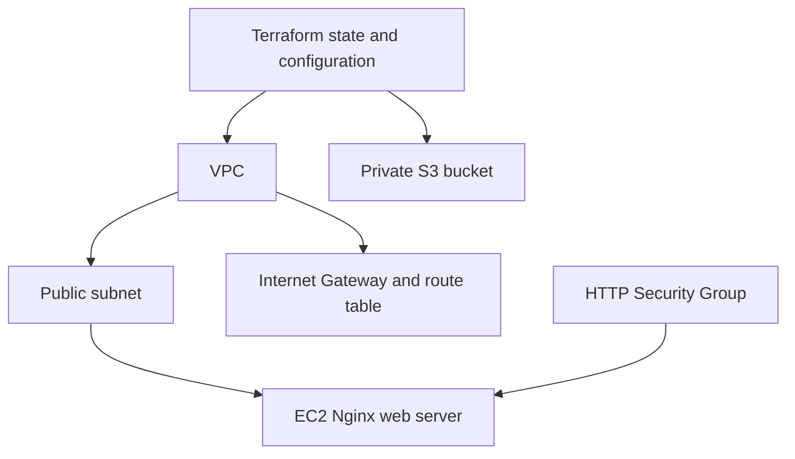
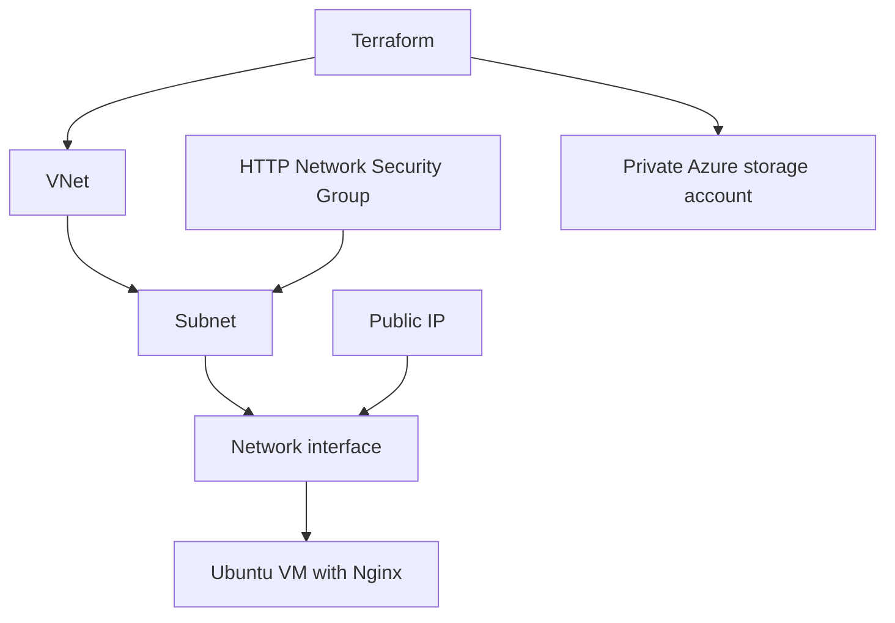

# Session 19: Cloud and Terraform in Action

**Nitish Kumar Bhambu — 24BCS10589**

The [AWS project](aws/) creates a VPC, public subnet, Internet Gateway, routes, HTTP Security Group, an EC2 web server and a private S3 bucket. AMI lookup uses the Amazon Linux public SSM parameter. SSH is not opened. Resource references connect the dependency graph; the web VM waits for its subnet route association.



Copy terraform.tfvars.example to a local tfvars file, choose a unique bucket name, then run the workflow below. HTTP installation via user_data is asynchronous; a created VM does not by itself prove the web server is ready. Verify the output URL with curl after boot.

```bash
terraform init
terraform fmt
terraform validate
terraform plan -out=tfplan
terraform apply tfplan
terraform show
terraform output
# After collecting evidence and confirming resources are no longer needed:
terraform plan -destroy -out=tfplan
terraform apply tfplan
```

The final two commands execute a reviewed destroy plan. `terraform destroy` is the interactive shortcut for that destruction workflow. Do not apply or destroy a different person's state. State records resource identities and can include secrets; it is ignored here. References between resource attributes express dependencies, and Terraform orders operations from that graph.
## Azure alternative

[azure-alternative/](azure-alternative/) was applied against the real Azure for Students subscription in Central India. It created a VNet, subnet, Network Security Group, HTTP rule, network interface, public IP, Ubuntu VM and private storage account. Cloud-init installed Nginx, and curl returned `Hello World from Terraform on Azure`. All nine Terraform-managed resources were then destroyed; the state list was empty.

The initial B1s request failed because that size had no available capacity. The successful run used Standard_D2s_v3. Storage polling initially failed because shared-key authentication was disabled; enabling the provider's Entra authentication and granting Blob Data Contributor fixed it. These failures and the successful recovery are retained in the transcript.

The resource group was a shared bootstrap dependency for these coursework exercises; it was deleted after the final AKS lab. The AWS project was validated but was not applied. Azure is an explicit substitute and instructor acceptance is still unknown.



[Actual plan/apply/show/output and HTTP verification](outputs/azure-run.txt) · [Destroy and empty state](outputs/azure-destroy.txt) · [AWS validation](aws/validation.txt) · [Azure validation](azure-alternative/validation.txt)

<!-- EVIDENCE -->

### azure-destroy.txt

[Complete transcript](outputs/azure-destroy.txt)

````text

$ terraform -chdir=18-cloud-terraform/azure-alternative destroy -auto-approve -input=false -no-color
data.azurerm_resource_group.lab: Reading...
data.azurerm_resource_group.lab: Read complete after 0s [id=/subscriptions/<subscription-id>/resourceGroups/rg-devops-homework]
azurerm_public_ip.web[0]: Refreshing state... [id=/subscriptions/<subscription-id>/resourceGroups/rg-devops-homework/providers/Microsoft.Network/publicIPAddresses/pip-devops-homework]
azurerm_network_security_group.app: Refreshing state... [id=/subscriptions/<subscription-id>/resourceGroups/rg-devops-homework/providers/Microsoft.Network/networkSecurityGroups/nsg-devops-homework]
azurerm_virtual_network.lab: Refreshing state... [id=/subscriptions/<subscription-id>/resourceGroups/rg-devops-homework/providers/Microsoft.Network/virtualNetworks/vnet-devops-homework]
azurerm_storage_account.lab: Refreshing state... [id=/subscriptions/<subscription-id>/resourceGroups/rg-devops-homework/providers/Microsoft.Storage/storageAccounts/nitishhw1791379436]
azurerm_network_security_rule.http[0]: Refreshing state... [id=/subscriptions/<subscription-id>/resourceGroups/rg-devops-homework/providers/Microsoft.Network/networkSecurityGroups/nsg-devops-homework/securityRules/http]
azurerm_subnet.app: Refreshing state... [id=/subscriptions/<subscription-id>/resourceGroups/rg-devops-homework/providers/Microsoft.Network/virtualNetworks/vnet-devops-homework/subnets/application]
azurerm_subnet_network_security_group_association.app: Refreshing state... [id=/subscriptions/<subscription-id>/resourceGroups/rg-devops-homework/providers/Microsoft.Network/virtualNetworks/vnet-devops-homework/subnets/application]
azurerm_network_interface.web[0]: Refreshing state... [id=/subscriptions/<subscription-id>/resourceGroups/rg-devops-homework/providers/Microsoft.Network/networkInterfaces/nic-devops-homework]
azurerm_linux_virtual_machine.web[0]: Refreshing state... [id=/subscriptions/<subscription-id>/resourceGroups/rg-devops-homework/providers/Microsoft.Compute/virtualMachines/vm-devops-homework]

Terraform used the selected providers to generate the following execution
plan. Resource actions are indicated with the following symbols:
  - destroy

Terraform will perform the following actions:

  # azurerm_linux_virtual_machine.web[0] will be destroyed
  - resource "azurerm_linux_virtual_machine" "web" {
      - admin_username                                         = "labstudent" -> null
      - allow_extension_operations                             = true -> null
      - bypass_platform_safety_checks_on_user_schedule_enabled = false -> null
      - computer_name                                          = "vm-devops-homework" -> null
      - custom_data                                            = (sensitive value) -> null
      - disable_password_authentication                        = true -> null
      - disk_controller_type                                   = "SCSI" -> null
      - encryption_at_host_enabled                             = false -> null
      - extensions_time_budget                                 = "PT1H30M" -> null
      - id                                                     = "/subscriptions/<subscription-id>/resourceGroups/rg-devops-homework/providers/Microsoft.Compute/virtualMachines/vm-devops-homework" -> null
      - location                                               = "centralindia" -> null
      - max_bid_price                                          = -1 -> null
      - name                                                   = "vm-devops-homework" -> null
      - network_interface_ids                                  = [
          - "/subscriptions/<subscription-id>/resourceGroups/rg-devops-homework/providers/Microsoft.Network/networkInterfaces/nic-devops-homework",
        ] -> null
      - os_managed_disk_id                                     = "/subscriptions/<subscription-id>/resourceGroups/rg-devops-homework/providers/Microsoft.Compute/disks/vm-devops-homework_OsDisk_1_26d49dd2e6204594a652ba8ac6ff46c0" -> null
      - patch_assessment_mode                                  = "ImageDefault" -> null
      - patch_mode                                             = "ImageDefault" -> null
      - platform_fault_domain                                  = -1 -> null
      - priority                                               = "Regular" -> null
      - private_ip_address                                     = "10.40.1.4" -> null
      - private_ip_addresses                                   = [
          - "10.40.1.4",
        ] -> null
      - provision_vm_agent                                     = true -> null
      - public_ip_address                                      = "20.198.116.200" -> null
      - public_ip_addresses                                    = [
          - "20.198.116.200",
        ] -> null
      - resource_group_name                                    = "rg-devops-homework" -> null
      - secure_boot_enabled                                    = false -> null
      - size                                                   = "Standard_D2s_v3" -> null
      - tags                                                   = {} -> null
      - virtual_machine_id                                     = "0d8970b9-fb02-4cdf-8dc5-164d0bbe6329" -> null
      - vm_agent_platform_updates_enabled                      = true -> null
      - vtpm_enabled                                           = false -> null
        # (13 unchanged attributes hidden)

      - admin_ssh_key {
          - public_key = "ssh-ed25519 AAAAC3NzaC1lZDI1NTE5AAAAIHT9CMqRYztnGtMq31Q/HNZydQ93E+NkPLKJmmO9ywz/ zephoryx@fedora" -> null
          - username   = "labstudent" -> null
        }

[Excerpt: 225 intermediate lines omitted; complete transcript linked above.]

      - id                        = "/subscriptions/<subscription-id>/resourceGroups/rg-devops-homework/providers/Microsoft.Network/virtualNetworks/vnet-devops-homework/subnets/application" -> null
      - network_security_group_id = "/subscriptions/<subscription-id>/resourceGroups/rg-devops-homework/providers/Microsoft.Network/networkSecurityGroups/nsg-devops-homework" -> null
      - subnet_id                 = "/subscriptions/<subscription-id>/resourceGroups/rg-devops-homework/providers/Microsoft.Network/virtualNetworks/vnet-devops-homework/subnets/application" -> null
    }

  # azurerm_virtual_network.lab will be destroyed
  - resource "azurerm_virtual_network" "lab" {
      - address_space                  = [
          - "10.40.0.0/16",
        ] -> null
      - dns_servers                    = [] -> null
      - flow_timeout_in_minutes        = 0 -> null
      - guid                           = "204f6bb2-1a49-4ae2-a747-5953898d9e6b" -> null
      - id                             = "/subscriptions/<subscription-id>/resourceGroups/rg-devops-homework/providers/Microsoft.Network/virtualNetworks/vnet-devops-homework" -> null
      - location                       = "centralindia" -> null
      - name                           = "vnet-devops-homework" -> null
      - private_endpoint_vnet_policies = "Disabled" -> null
      - resource_group_name            = "rg-devops-homework" -> null
      - subnet                         = [
          - {
              - address_prefixes                              = [
                  - "10.40.1.0/24",
                ]
              - default_outbound_access_enabled               = true
              - delegation                                    = []
              - id                                            = "/subscriptions/<subscription-id>/resourceGroups/rg-devops-homework/providers/Microsoft.Network/virtualNetworks/vnet-devops-homework/subnets/application"
              - name                                          = "application"
              - private_endpoint_network_policies             = "Disabled"
              - private_link_service_network_policies_enabled = true
              - security_group                                = "/subscriptions/<subscription-id>/resourceGroups/rg-devops-homework/providers/Microsoft.Network/networkSecurityGroups/nsg-devops-homework"
              - service_endpoint_policy_ids                   = []
              - service_endpoints                             = []
                # (1 unchanged attribute hidden)
            },
        ] -> null
      - tags                           = {} -> null
        # (2 unchanged attributes hidden)
    }

Plan: 0 to add, 0 to change, 9 to destroy.

Changes to Outputs:
  - resource_group  = "rg-devops-homework" -> null
  - storage_account = "nitishhw1791379436" -> null
  - vnet_id         = "/subscriptions/<subscription-id>/resourceGroups/rg-devops-homework/providers/Microsoft.Network/virtualNetworks/vnet-devops-homework" -> null
  - web_url         = "http://20.198.116.200" -> null
azurerm_network_security_rule.http[0]: Destroying... [id=/subscriptions/<subscription-id>/resourceGroups/rg-devops-homework/providers/Microsoft.Network/networkSecurityGroups/nsg-devops-homework/securityRules/http]
azurerm_linux_virtual_machine.web[0]: Destroying... [id=/subscriptions/<subscription-id>/resourceGroups/rg-devops-homework/providers/Microsoft.Compute/virtualMachines/vm-devops-homework]
azurerm_storage_account.lab: Destroying... [id=/subscriptions/<subscription-id>/resourceGroups/rg-devops-homework/providers/Microsoft.Storage/storageAccounts/nitishhw1791379436]
azurerm_storage_account.lab: Destruction complete after 5s
azurerm_network_security_rule.http[0]: Still destroying... [id=/subscriptions/<subscription-id>...nsg-devops-homework/securityRules/http, 00m10s elapsed]
azurerm_linux_virtual_machine.web[0]: Still destroying... [id=/subscriptions/<subscription-id>...ute/virtualMachines/vm-devops-homework, 00m10s elapsed]
azurerm_network_security_rule.http[0]: Destruction complete after 11s
azurerm_linux_virtual_machine.web[0]: Still destroying... [id=/subscriptions/<subscription-id>...ute/virtualMachines/vm-devops-homework, 00m20s elapsed]
azurerm_linux_virtual_machine.web[0]: Still destroying... [id=/subscriptions/<subscription-id>...ute/virtualMachines/vm-devops-homework, 00m30s elapsed]
azurerm_linux_virtual_machine.web[0]: Destruction complete after 33s
azurerm_subnet_network_security_group_association.app: Destroying... [id=/subscriptions/<subscription-id>/resourceGroups/rg-devops-homework/providers/Microsoft.Network/virtualNetworks/vnet-devops-homework/subnets/application]
azurerm_network_interface.web[0]: Destroying... [id=/subscriptions/<subscription-id>/resourceGroups/rg-devops-homework/providers/Microsoft.Network/networkInterfaces/nic-devops-homework]
azurerm_subnet_network_security_group_association.app: Still destroying... [id=/subscriptions/<subscription-id>...et-devops-homework/subnets/application, 00m10s elapsed]
azurerm_network_interface.web[0]: Still destroying... [id=/subscriptions/<subscription-id>.../networkInterfaces/nic-devops-homework, 00m10s elapsed]
azurerm_network_interface.web[0]: Destruction complete after 10s
azurerm_public_ip.web[0]: Destroying... [id=/subscriptions/<subscription-id>/resourceGroups/rg-devops-homework/providers/Microsoft.Network/publicIPAddresses/pip-devops-homework]
azurerm_subnet_network_security_group_association.app: Destruction complete after 14s
azurerm_subnet.app: Destroying... [id=/subscriptions/<subscription-id>/resourceGroups/rg-devops-homework/providers/Microsoft.Network/virtualNetworks/vnet-devops-homework/subnets/application]
azurerm_network_security_group.app: Destroying... [id=/subscriptions/<subscription-id>/resourceGroups/rg-devops-homework/providers/Microsoft.Network/networkSecurityGroups/nsg-devops-homework]
azurerm_public_ip.web[0]: Still destroying... [id=/subscriptions/<subscription-id>.../publicIPAddresses/pip-devops-homework, 00m10s elapsed]
azurerm_public_ip.web[0]: Destruction complete after 11s
azurerm_subnet.app: Still destroying... [id=/subscriptions/<subscription-id>...et-devops-homework/subnets/application, 00m10s elapsed]
azurerm_network_security_group.app: Still destroying... [id=/subscriptions/<subscription-id>...workSecurityGroups/nsg-devops-homework, 00m10s elapsed]
azurerm_subnet.app: Destruction complete after 10s
azurerm_virtual_network.lab: Destroying... [id=/subscriptions/<subscription-id>/resourceGroups/rg-devops-homework/providers/Microsoft.Network/virtualNetworks/vnet-devops-homework]
azurerm_network_security_group.app: Destruction complete after 11s
azurerm_virtual_network.lab: Still destroying... [id=/subscriptions/<subscription-id>...k/virtualNetworks/vnet-devops-homework, 00m10s elapsed]
azurerm_virtual_network.lab: Destruction complete after 11s

Destroy complete! Resources: 9 destroyed.
[exit 0]

$ terraform -chdir=18-cloud-terraform/azure-alternative state list
[exit 0]
````

### azure-run.txt

[Complete transcript](outputs/azure-run.txt)

````text

$ az group create --name rg-devops-homework --location centralindia --tags purpose=devops-homework --query {name:name,location:location,provisioningState:properties.provisioningState} -o json
{
  "location": "centralindia",
  "name": "rg-devops-homework",
  "provisioningState": "Succeeded"
}

[exit 0]

$ terraform -chdir=18-cloud-terraform/azure-alternative init -input=false -no-color
Initializing the backend...

Initializing provider plugins...
- Reusing previous version of hashicorp/azurerm from the dependency lock file
- Using previously-installed hashicorp/azurerm v4.81.0

Terraform has been successfully initialized!

[exit 0]

$ terraform -chdir=18-cloud-terraform/azure-alternative fmt -check

[exit 0]

$ terraform -chdir=18-cloud-terraform/azure-alternative validate -no-color
Success! The configuration is valid.


[exit 0]

$ terraform -chdir=18-cloud-terraform/azure-alternative plan -out=lab.tfplan -input=false -no-color
data.azurerm_resource_group.lab: Reading...
data.azurerm_resource_group.lab: Read complete after 2s [id=/subscriptions/<subscription-id>/resourceGroups/rg-devops-homework]

Terraform used the selected providers to generate the following execution
plan. Resource actions are indicated with the following symbols:
  + create

Terraform will perform the following actions:

  # azurerm_linux_virtual_machine.web[0] will be created
  + resource "azurerm_linux_virtual_machine" "web" {
      + admin_username                                         = "labstudent"
      + allow_extension_operations                             = (known after apply)
      + bypass_platform_safety_checks_on_user_schedule_enabled = false
      + computer_name                                          = (known after apply)
      + custom_data                                            = (sensitive value)
      + disable_password_authentication                        = true
      + disk_controller_type                                   = (known after apply)
      + extensions_time_budget                                 = "PT1H30M"
      + id                                                     = (known after apply)
      + location                                               = "centralindia"
      + max_bid_price                                          = -1
      + name                                                   = "vm-devops-homework"
      + network_interface_ids                                  = (known after apply)
      + os_managed_disk_id                                     = (known after apply)
      + patch_assessment_mode                                  = (known after apply)
      + patch_mode                                             = (known after apply)
      + platform_fault_domain                                  = -1
      + priority                                               = "Regular"
      + private_ip_address                                     = (known after apply)
      + private_ip_addresses                                   = (known after apply)
      + provision_vm_agent                                     = (known after apply)
      + public_ip_address                                      = (known after apply)

[Excerpt: 915 intermediate lines omitted; complete transcript linked above.]

    private_endpoint_network_policies             = "Disabled"
    private_link_service_network_policies_enabled = true
    resource_group_name                           = "rg-devops-homework"
    service_endpoint_policy_ids                   = []
    service_endpoints                             = []
    sharing_scope                                 = null
    virtual_network_name                          = "vnet-devops-homework"
}

# azurerm_subnet_network_security_group_association.app:
resource "azurerm_subnet_network_security_group_association" "app" {
    id                        = "/subscriptions/<subscription-id>/resourceGroups/rg-devops-homework/providers/Microsoft.Network/virtualNetworks/vnet-devops-homework/subnets/application"
    network_security_group_id = "/subscriptions/<subscription-id>/resourceGroups/rg-devops-homework/providers/Microsoft.Network/networkSecurityGroups/nsg-devops-homework"
    subnet_id                 = "/subscriptions/<subscription-id>/resourceGroups/rg-devops-homework/providers/Microsoft.Network/virtualNetworks/vnet-devops-homework/subnets/application"
}

# azurerm_virtual_network.lab:
resource "azurerm_virtual_network" "lab" {
    address_space                  = [
        "10.40.0.0/16",
    ]
    bgp_community                  = null
    dns_servers                    = []
    edge_zone                      = null
    flow_timeout_in_minutes        = 0
    guid                           = "204f6bb2-1a49-4ae2-a747-5953898d9e6b"
    id                             = "/subscriptions/<subscription-id>/resourceGroups/rg-devops-homework/providers/Microsoft.Network/virtualNetworks/vnet-devops-homework"
    location                       = "centralindia"
    name                           = "vnet-devops-homework"
    private_endpoint_vnet_policies = "Disabled"
    resource_group_name            = "rg-devops-homework"
    subnet                         = [
        {
            address_prefixes                              = [
                "10.40.1.0/24",
            ]
            default_outbound_access_enabled               = true
            delegation                                    = []
            id                                            = "/subscriptions/<subscription-id>/resourceGroups/rg-devops-homework/providers/Microsoft.Network/virtualNetworks/vnet-devops-homework/subnets/application"
            name                                          = "application"
            private_endpoint_network_policies             = "Disabled"
            private_link_service_network_policies_enabled = true
            route_table_id                                = null
            security_group                                = "/subscriptions/<subscription-id>/resourceGroups/rg-devops-homework/providers/Microsoft.Network/networkSecurityGroups/nsg-devops-homework"
            service_endpoint_policy_ids                   = []
            service_endpoints                             = []
        },
    ]
    tags                           = {}
}


Outputs:

resource_group = "rg-devops-homework"
storage_account = "nitishhw1791379436"
vnet_id = "/subscriptions/<subscription-id>/resourceGroups/rg-devops-homework/providers/Microsoft.Network/virtualNetworks/vnet-devops-homework"
web_url = "http://20.198.116.200"

[exit 0]

$ terraform -chdir=18-cloud-terraform/azure-alternative output -no-color
resource_group = "rg-devops-homework"
storage_account = "nitishhw1791379436"
vnet_id = "/subscriptions/<subscription-id>/resourceGroups/rg-devops-homework/providers/Microsoft.Network/virtualNetworks/vnet-devops-homework"
web_url = "http://20.198.116.200"

[exit 0]

$ curl --fail --retry 30 --retry-all-errors --retry-delay 5 http://20.198.116.200
  % Total    % Received % Xferd  Average Speed  Time    Time    Time   Current
                                 Dload  Upload  Total   Spent   Left   Speed

  0      0   0      0   0      0      0      0                              0
100     36 100     36   0      0    791      0                              0
100     36 100     36   0      0    791      0                              0
100     36 100     36   0      0    790      0                              0
Hello World from Terraform on Azure

[exit 0]
````
