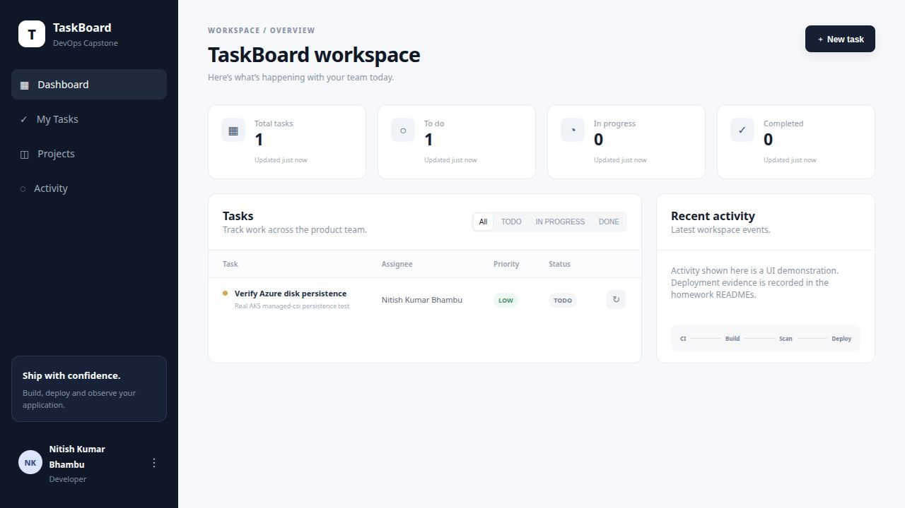

# TaskBoard demo

**Nitish Kumar Bhambu — 24BCS10589**

I used this React, FastAPI and PostgreSQL app for the CI/CD, DevSecOps and monitoring exercises in Sessions 16, 17 and 20. It is adapted from the instructor's starter; see [ATTRIBUTION.md](ATTRIBUTION.md).

## Run locally

From the repository root:

```bash
export TASKBOARD_DB_PASSWORD=classroom-example-only
docker compose -f demo-app/docker/compose.yaml up --build -d
curl http://localhost:13000/health
```

Open http://localhost:13000. Compose starts the database, runs the Alembic migration and starts the backend and frontend.

## Test and security results

The nine API tests cover CRUD, validation, missing tasks, readiness and metrics. They use an isolated test database.

```bash
cd demo-app/application/backend
python3 -m venv .venv
source .venv/bin/activate
pip install -r requirements-dev.txt
pytest -v
```

The CI run below passed the tests, Bandit, dependency audits, Gitleaks and both Trivy image scans. The rebuilt images had zero HIGH or CRITICAL findings.

## CI/CD and DevSecOps

The [workflow](../.github/workflows/devops.yml) builds both images, scans them, tests a Helm deployment in kind and publishes SHA-tagged images to GHCR. A failed check stops publication.

- [Successful CI run](https://github.com/ThereIsSomething/devops-work/actions/runs/37630785578)
- [Successful Azure deployment](https://github.com/ThereIsSomething/devops-work/actions/runs/37631537431)
- [Security checks](security/README.md)

The Azure run used images tagged `e45aaec63c7220da29f099eecb0f16d6f30ceb21`. It logged in through OIDC, deployed with Helm and checked the API and database readiness.

## Kubernetes and monitoring

The chart is in [helm/taskboard](helm/taskboard/). It includes the frontend, backend, PostgreSQL PVC, migration Job, Ingress, probes and HPA.

[Prometheus and Grafana](monitoring/README.md) collect application metrics. [Argo CD](gitops/README.md) watches the chart in Git and repairs replica drift. The local GitOps workload uses the `homework-final` namespace retained from the original demo setup.

## Azure browser evidence
I opened TaskBoard at the Azure LoadBalancer IP `4.186.51.68` on 7 October 2026. The screenshot shows the cloud-backed task created for the managed-disk persistence check. The public Service and Azure resources were deleted after verification.



The final Azure workflow authenticated with GitHub OIDC, deployed the exact images with Helm, checked `/health`, database readiness, API responses and Traefik routing, and installed the monitoring stack. The runner's temporary API allowlist entry was removed afterward.

For the persistence check, I created a task, replaced `postgres-0`, waited for its replacement, then read the same task back from the managed disk and deleted it. The frontend Service was restored to ClusterIP after the browser check.

```bash
zephoryx@fedora$ kubectl -n homework-final get pods,svc,pvc,hpa,ingress
NAME                            READY   STATUS      RESTARTS        AGE
pod/backend-56c8f8bb87-rhq6q    1/1     Running     1 (3m25s ago)   6m26s
pod/backend-56c8f8bb87-znxvn    1/1     Running     1 (3m30s ago)   6m41s
pod/frontend-86d6fc5b78-7ts9t   1/1     Running     0               6m41s
# ... output shortened ...
horizontalpodautoscaler.autoscaling/backend   Deployment/backend   cpu: 3%/60%   2         5         2          6m42s

NAME                                  CLASS     HOSTS             ADDRESS           PORTS   AGE
ingress.networking.k8s.io/taskboard   traefik   taskboard.local   135.235.247.178   80      6m41s

zephoryx@fedora$ kubectl -n homework-final patch svc frontend --type=merge -p '{"spec":{"type":"LoadBalancer"}}'
service/frontend patched

zephoryx@fedora$ kubectl -n homework-final get svc frontend -o wide
NAME       TYPE           CLUSTER-IP    EXTERNAL-IP   PORT(S)        AGE     SELECTOR
frontend   LoadBalancer   10.0.219.40   4.186.51.68   80:30273/TCP   6m57s   app=taskboard-frontend

zephoryx@fedora$ curl -f http://4.186.51.68/health
{"status":"UP"}

HTTP POST http://4.186.51.68/api/tasks
201 {"title":"Verify Azure disk persistence","description":"Real AKS managed-csi persistence test","priority":"LOW","status":"TODO","assignee":"Nitish Kumar Bhambu","id":1,"created_at":"2026-10-07T13:47:49.342325Z"}

zephoryx@fedora$ kubectl -n homework-final delete pod postgres-0
pod "postgres-0" deleted from homework-final namespace

zephoryx@fedora$ kubectl -n homework-final wait --for=create pod/postgres-0
pod/postgres-0 condition met

zephoryx@fedora$ kubectl -n homework-final wait --for=condition=Ready pod/postgres-0
pod/postgres-0 condition met

HTTP GET http://4.186.51.68/api/tasks/1
200 {"title":"Verify Azure disk persistence","description":"Real AKS managed-csi persistence test","priority":"LOW","status":"TODO","assignee":"Nitish Kumar Bhambu","id":1,"created_at":"2026-10-07T13:47:49.342325Z"}

HTTP DELETE http://4.186.51.68/api/tasks/1
204

zephoryx@fedora$ kubectl -n homework-final patch svc frontend --type=merge -p '{"spec":{"type":"ClusterIP"}}'
service/frontend patched

zephoryx@fedora$ kubectl -n homework-final get svc frontend
NAME       TYPE        CLUSTER-IP    EXTERNAL-IP   PORT(S)   AGE
frontend   ClusterIP   10.0.219.40   <none>        80/TCP    8m28s

zephoryx@fedora$ kubectl -n homework-final top pods
NAME                        CPU(cores)   MEMORY(bytes)
backend-56c8f8bb87-rhq6q    4m           69Mi
backend-56c8f8bb87-znxvn    4m           68Mi
frontend-86d6fc5b78-7ts9t   1m           3Mi
frontend-86d6fc5b78-mrlhz   1m           3Mi
postgres-0                  13m          19Mi
```

## Cloud cleanup results

The storage, VM and AKS exercises were destroyed after verification. The final subscription checks returned empty lists:

```bash
zephoryx@fedora$ az resource list -o json
[]

zephoryx@fedora$ az group list -o json
[]
```

The AKS configuration used for the pipeline exercise is in [aks-demo](../18-cloud-terraform/aks-demo/README.md). The public IP above is no longer a running demo.
