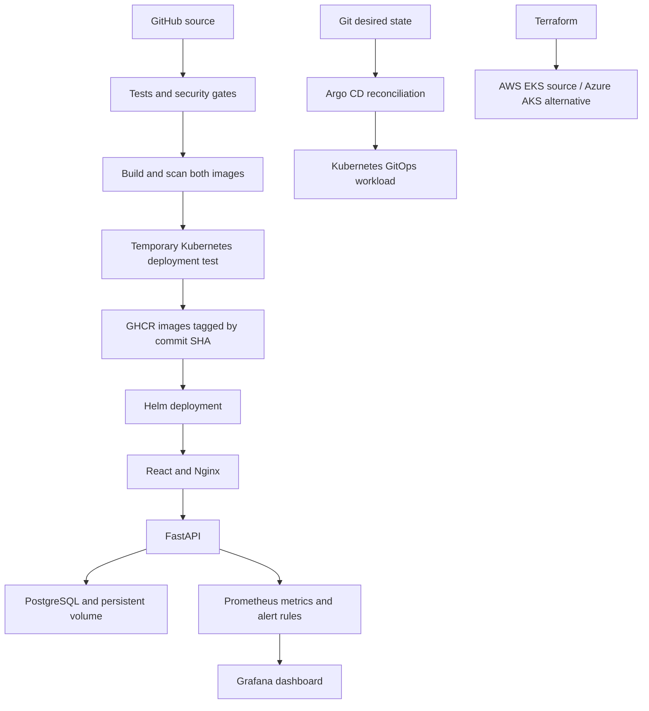

# Session 21: TaskBoard DevOps project

**Nitish Kumar Bhambu — 24BCS10589**

TaskBoard is a small React, FastAPI and PostgreSQL application. The application and initial migration are adapted from the instructor's starter project; [ATTRIBUTION.md](ATTRIBUTION.md) records the starting point and changes. The goal is to take a useful application through tests, containers, Kubernetes, Helm, security checks, monitoring and GitOps, with separate Terraform projects for the requested cloud infrastructure.



## Application and tests

The API supports create, list, read, update and delete for tasks, plus statistics, `/health`, `/ready` and `/metrics`. Health checks the application process; readiness queries the database. Alembic creates the schema before the application becomes ready. Nine isolated tests cover CRUD, validation, missing objects, health/readiness and metrics. Each test gets its own in-memory database; it does not use the running PostgreSQL instance.

```bash
cd final-devops-project/application/backend
python3 -m venv .venv
.venv/bin/pip install -r requirements-dev.txt
.venv/bin/pytest -v
```

[Actual test output](outputs/tests.txt) · [Migration output](outputs/migration.txt)

## Docker

Both application images run as non-root users. The frontend uses a multi-stage Node build and an Nginx runtime on port 8080. Compose starts PostgreSQL, waits for database readiness, runs a one-off migration, then starts backend and frontend. The database port is internal to the Compose network.

```bash
export TASKBOARD_DB_PASSWORD='classroom-example-only' # disposable local demo only
# Use a different password outside this lab. Keep it out of Git.
docker compose -f final-devops-project/docker/compose.yaml up --build -d
curl --fail http://localhost:13000/health
curl --fail http://localhost:13000/api/tasks
```

Open http://localhost:13000 to use TaskBoard. [Compose build/start output](outputs/compose.txt)

## Kubernetes and Helm

The chart includes frontend/backend Deployments, Services, a ConfigMap, an external Secret reference, a PostgreSQL StatefulSet/PVC, an Alembic migration Job, an Ingress, backend HPA, and startup/readiness/liveness probes. PostgreSQL has one persistent replica; scaling the database itself would require replication and a different design.

`kubernetes/rendered.yaml` is generated from the chart for inspection or a direct-manifest exercise. Apply the rendered resources or install the chart as the owner of the workload; avoid independently managing the same objects with both methods.

```bash
scripts/final-local.sh
# Local browser access to the Kubernetes deployment:
scripts/kubectl -n homework-final port-forward svc/frontend 13002:80
# Or access through the controller, preserving the Ingress Host rule:
curl -H 'Host: taskboard.local' http://localhost:18082/health
```

The local helper imports images into Minikube. PostgreSQL is pulled through Minikube’s CRI runtime. Importing it through the image helper left kubelet reporting `ErrImageNeverPull` despite a visible cache entry; a direct CRI pull and `IfNotPresent` resolved the failure. The public `secret.example.yaml` is a dummy classroom Secret. Real credentials must be supplied outside Git. HPA requires metrics-server. The Ingress class is `traefik`, matching the explicitly configured controller in Session 12.

[Local deployment output](outputs/local-deploy.txt) · [Deployment recovery](outputs/helm-recovery.txt) · [PostgreSQL recovery](outputs/postgres-recovery.txt)

## CI/CD and DevSecOps

The executable [repository-root workflow](../.github/workflows/devops.yml) runs tests, builds the frontend, performs Bandit SAST, Python/npm SCA, Gitleaks secret scanning, builds both images and runs Trivy image gates. It verifies a Helm deployment in a disposable kind cluster and then publishes SHA-tagged images to GHCR. Pull requests run checks without publishing images. The nested `.github/workflows/` copy is supplied as project reference and is not an executable workflow at this repository depth.

The temporary cluster demonstrates deployment automation. The separate Azure workflow deploys an already verified image SHA to AKS using GitHub OIDC. It temporarily adds the current runner IP to the cluster API allowlist and restores the original range afterward. A laptop Minikube kubeconfig does not make Minikube reachable from a hosted runner.

[Security tools and thresholds](security/README.md) · [SAST output](outputs/sast.txt) · [Dependency audit](outputs/sca.txt) · [Secret scan](outputs/secret-scan.txt) · [Backend image scan](outputs/image-backend-scan.txt) · [Frontend image scan](outputs/image-frontend-scan.txt)

Successful CI runs, exact SHA image tags and full logs are recorded in [CI evidence](outputs/hosted-ci.md). [The final Azure deployment also passed](https://github.com/ThereIsSomething/devops-work/actions/runs/37631537431). A workflow file or local test success is not evidence that a hosted pipeline passed.

## Terraform and cloud

[terraform/](terraform/) contains valid AWS EKS infrastructure: a VPC, two public subnets, routing, IAM roles, a managed node group and a scoped API allowlist. [terraform-azure/](terraform-azure/README.md) is the real Azure AKS alternative, using an existing lab resource group and Entra/Azure RBAC. Neither is mocked. The static validation outputs are retained in each project.

No actual AWS resources are claimed. Real Azure exercises run in the dedicated `rg-devops-homework` resource group in Central India with the signed-in student account. The assignment names AWS/EKS, so instructor approval is required for Azure to count as an equivalent submission. Never treat successful `terraform validate` as a successful cloud deployment. After collecting cloud evidence, Terraform destroy and a final Azure inventory check verify resource removal.

## Azure browser evidence

TaskBoard was opened at the real Azure LoadBalancer IP `4.186.51.68` on 7 October 2026. The screenshot shows the cloud-backed task created for the managed-disk persistence check. The public service and cloud resources are removed after verification; this IP is historical evidence, not a permanent demo address.


[Successful hosted Azure deployment](outputs/azure-deployment.md) · [Public IP, HTTP/CRUD and persistent-volume verification](outputs/azure-functional.txt) · [Disk initialization recovery](outputs/azure-storage-recovery.md)

## Monitoring and GitOps

[Prometheus and Grafana](monitoring/README.md) collect real application metrics, process CPU/memory and scrape health. Container logs and kubectl top provide additional evidence. The alert rule fires if TaskBoard cannot be scraped for 30 seconds. Tracing is explained in Session 20 but is not implemented.

[TaskBoard GitOps](gitops/README.md) uses Argo CD to render the chart from Git, synchronize the local release and repair frontend replica drift. This follows the direct Helm exercise; Argo is now the local workload owner. Session 20 also records a separate Git commit changing its web Deployment from two replicas to three.

## Troubleshooting challenge

The challenge deliberately breaks a backend Service selector, then its target port, then the backend image tag. It checks direct Pod-IP connectivity, endpoint addresses, labels, Service configuration and events, fixes each cause, and verifies DNS and `/ready` afterward.

```bash
python3 scripts/final-troubleshooting.py
```

[Before/after output](outputs/troubleshooting.txt) · [Real Azure disk initialization failure and fix](outputs/azure-storage-recovery.md) · [Browser form fix and retest](outputs/browser-check.txt)

Additional issues found during the real setup included an Ingress class mismatch, a PostgreSQL image-cache/pull problem, image vulnerabilities and a React form handler that lost its event target after await. Each was investigated and fixed; the browser form was retested after the fix. Their recovery is recorded in Session 12 and this project's output files.

## Lessons from the exercise

A Running Pod can still be unready. A healthy application can be unreachable because of a Service selector, target port or Ingress rule. A migration must finish before database-dependent readiness can pass. A newly mounted managed disk can contain `lost+found`, so PostgreSQL needs a data subdirectory. Argo sync waves order database readiness before schema migration. A successful security scan is evidence about the checks and advisory data available at that time, not a guarantee that the application is secure. GitOps and direct Helm management need clear ownership of each workload.

## Cleanup

`scripts/cleanup-homework.sh` removes only the homework Kubernetes namespaces and stops the homework Compose stack. It retains the Compose database volume. Deleting the final namespace deletes its PVCs; save any data you need first. Cloud resources are destroyed from their own Terraform state, separately from local cleanup. The lab group is then deleted and a subscription inventory check confirms zero remaining resources. [Azure cleanup transcript](outputs/azure-destroy.txt).
