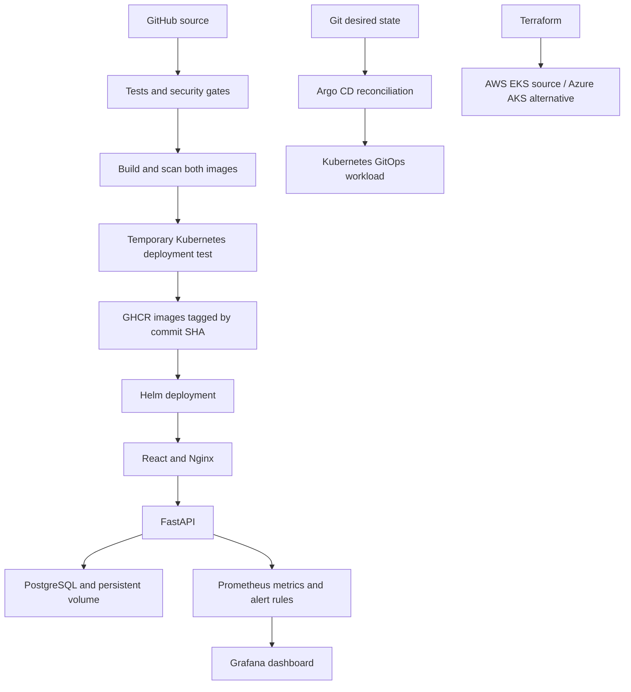

# Session 21: TaskBoard DevOps project

**Nitish Kumar Bhambu — 24BCS10589**

TaskBoard uses React, FastAPI and PostgreSQL. I adapted the instructor's starter app; [ATTRIBUTION.md](ATTRIBUTION.md) lists the changes.



## Application and tests

The API supports task CRUD, statistics, `/health`, `/ready` and `/metrics`. Alembic creates the schema. Nine isolated tests cover CRUD, validation, missing tasks, health, readiness and metrics.

```bash
cd final-devops-project/application/backend
python3 -m venv .venv
.venv/bin/pip install -r requirements-dev.txt
.venv/bin/pytest -v
```

The [test results](#test-and-security-results) are included below.

## Docker

Both images run as non-root users. The frontend uses a multi-stage build and Nginx on port 8080. Compose starts PostgreSQL, runs the migration and starts the app.

```bash
export TASKBOARD_DB_PASSWORD='classroom-example-only' # disposable local demo only
# Use a different password outside this lab. Keep it out of Git.
docker compose -f final-devops-project/docker/compose.yaml up --build -d
curl --fail http://localhost:13000/health
curl --fail http://localhost:13000/api/tasks
```

Open http://localhost:13000 to use TaskBoard.

## Kubernetes and Helm

The chart includes Deployments, Services, ConfigMap, Secret reference, PostgreSQL StatefulSet/PVC, migration Job, Ingress, HPA and all three probes.

The rendered manifests are in `kubernetes/rendered.yaml`; the chart is in `helm/taskboard/`.

```bash
scripts/final-local.sh
# Local browser access to the Kubernetes deployment:
kubectl -n homework-final port-forward svc/frontend 13002:80
# Or access through the controller, preserving the Ingress Host rule:
curl -H 'Host: taskboard.local' http://localhost:18082/health
```

The helper loads images into Minikube. PostgreSQL needed a direct CRI pull and `IfNotPresent` to fix `ErrImageNeverPull`. The example Secret is a dummy value; real secrets stay out of Git. HPA uses metrics-server and Ingress uses Traefik.

[Deployment checks](#local-deployment-results) are included below.

## CI/CD and DevSecOps

The [workflow](../.github/workflows/devops.yml) runs tests, frontend build, Bandit, dependency audits, Gitleaks and Trivy. It checks a Helm deployment in kind, then publishes SHA-tagged GHCR images. Pull requests run checks without publishing.

The Azure workflow deploys a verified image SHA to AKS using OIDC. It adds the runner IP to the API allowlist for deployment, then restores the original range.

[Security tools and thresholds](security/README.md) · [Test and security results](#test-and-security-results)

[CI run 37630785578](https://github.com/ThereIsSomething/devops-work/actions/runs/37630785578) passed all checks and published the images used for the Azure deployment. [Azure deployment run 37631537431](https://github.com/ThereIsSomething/devops-work/actions/runs/37631537431) also passed. Both use application commit `e45aaec63c7220da29f099eecb0f16d6f30ceb21`.

```text
ghcr.io/thereissomething/devops-work-backend:e45aaec63c7220da29f099eecb0f16d6f30ceb21
ghcr.io/thereissomething/devops-work-frontend:e45aaec63c7220da29f099eecb0f16d6f30ceb21
```

The hosted logs and test/scan artifacts can be opened directly from these Actions runs.

## Terraform and cloud

[terraform/](terraform/) contains valid AWS EKS infrastructure: a VPC, two public subnets, routing, IAM roles, a managed node group and a scoped API allowlist. [terraform-azure/](terraform-azure/README.md) is the real Azure AKS alternative, using an existing lab resource group and Entra/Azure RBAC. Local validation results are included in the Terraform project READMEs.

The AWS configuration was validated locally. The live Azure exercises ran in the dedicated `rg-devops-homework` resource group in Central India with the signed-in student account. The assignment names AWS/EKS, so instructor approval is required for Azure to count as an equivalent submission. After collecting cloud evidence, Terraform destroy and a final Azure inventory check verify resource removal.

## Azure browser evidence

I opened TaskBoard at the Azure LoadBalancer IP `4.186.51.68` on 7 October 2026. The screenshot shows the cloud-backed task created for the managed-disk persistence check. The public Service and Azure resources were deleted after verification.


The final Azure workflow authenticated with GitHub OIDC, deployed the exact images with Helm, checked `/health`, database readiness, API responses and Traefik routing, and installed the monitoring stack. The runner's temporary API allowlist entry was removed afterward.

For the persistence check, I created a task, replaced `postgres-0`, waited for its replacement, then read the same task back from the managed disk and deleted it. The frontend Service was restored to ClusterIP after the browser check.

```bash
zephoryx@fedora$ kubectl -n homework-final get pods,svc,pvc,hpa,ingress
NAME                            READY   STATUS      RESTARTS        AGE
pod/backend-56c8f8bb87-rhq6q    1/1     Running     1 (3m25s ago)   6m26s
pod/backend-56c8f8bb87-znxvn    1/1     Running     1 (3m30s ago)   6m41s
pod/frontend-86d6fc5b78-7ts9t   1/1     Running     0               6m41s
# ... output shortened ...
horizontalpodautoscaler.autoscaling/backend   Deployment/backend   cpu: 3%/60%   2         5         2          6m42s

NAME                                  CLASS     HOSTS             ADDRESS           PORTS   AGE
ingress.networking.k8s.io/taskboard   traefik   taskboard.local   135.235.247.178   80      6m41s

zephoryx@fedora$ kubectl -n homework-final patch svc frontend --type=merge -p '{"spec":{"type":"LoadBalancer"}}'
service/frontend patched

zephoryx@fedora$ kubectl -n homework-final get svc frontend -o wide
NAME       TYPE           CLUSTER-IP    EXTERNAL-IP   PORT(S)        AGE     SELECTOR
frontend   LoadBalancer   10.0.219.40   4.186.51.68   80:30273/TCP   6m57s   app=taskboard-frontend

zephoryx@fedora$ curl -f http://4.186.51.68/health
{"status":"UP"}

HTTP POST http://4.186.51.68/api/tasks
201 {"title":"Verify Azure disk persistence","description":"Real AKS managed-csi persistence test","priority":"LOW","status":"TODO","assignee":"Nitish Kumar Bhambu","id":1,"created_at":"2026-10-07T13:47:49.342325Z"}

zephoryx@fedora$ kubectl -n homework-final delete pod postgres-0
pod "postgres-0" deleted from homework-final namespace

zephoryx@fedora$ kubectl -n homework-final wait --for=create pod/postgres-0
pod/postgres-0 condition met

zephoryx@fedora$ kubectl -n homework-final wait --for=condition=Ready pod/postgres-0
pod/postgres-0 condition met

HTTP GET http://4.186.51.68/api/tasks/1
200 {"title":"Verify Azure disk persistence","description":"Real AKS managed-csi persistence test","priority":"LOW","status":"TODO","assignee":"Nitish Kumar Bhambu","id":1,"created_at":"2026-10-07T13:47:49.342325Z"}

HTTP DELETE http://4.186.51.68/api/tasks/1
204

zephoryx@fedora$ kubectl -n homework-final patch svc frontend --type=merge -p '{"spec":{"type":"ClusterIP"}}'
service/frontend patched

zephoryx@fedora$ kubectl -n homework-final get svc frontend
NAME       TYPE        CLUSTER-IP    EXTERNAL-IP   PORT(S)   AGE
frontend   ClusterIP   10.0.219.40   <none>        80/TCP    8m28s

zephoryx@fedora$ kubectl -n homework-final top pods
NAME                        CPU(cores)   MEMORY(bytes)
backend-56c8f8bb87-rhq6q    4m           69Mi
backend-56c8f8bb87-znxvn    4m           68Mi
frontend-86d6fc5b78-7ts9t   1m           3Mi
frontend-86d6fc5b78-mrlhz   1m           3Mi
postgres-0                  13m          19Mi
```

## Monitoring and GitOps

[Prometheus and Grafana](monitoring/README.md) collect real application metrics, process CPU/memory and scrape health. Container logs and kubectl top provide additional evidence. The alert rule fires if TaskBoard cannot be scraped for 30 seconds. Tracing is explained in Session 20 but is not implemented.

[TaskBoard GitOps](gitops/README.md) uses Argo CD to render the chart from Git, synchronize the local release and repair frontend replica drift. This follows the direct Helm exercise; Argo is now the local workload owner. Session 20 also records a separate Git commit changing its web Deployment from two replicas to three.

## Troubleshooting challenge

The challenge deliberately breaks a backend Service selector, then its target port, then the backend image tag. It checks direct Pod-IP connectivity, endpoint addresses, labels, Service configuration and events, fixes each cause, and verifies DNS and `/ready` afterward.

```bash
python3 scripts/final-troubleshooting.py
```

[Before/after commands](#troubleshooting-results) are included below.

Additional issues found during the real setup included an Ingress class mismatch, a PostgreSQL image-cache/pull problem, image vulnerabilities and a React form handler that lost its event target after await. Each was investigated and fixed; the browser form was retested after the fix. Their fixes are described in Session 12 and the results below.

## Lessons from the exercise

The main lessons were to check readiness separately from Pod status, verify Service selectors and ports, and run migrations after the database is ready. PostgreSQL also needed a data subdirectory on the Azure disk.

## Cleanup

`scripts/cleanup-homework.sh` removes the local lab namespaces and stops Compose, keeping its database volume. Azure resources were destroyed separately; [the final inventory](#cloud-cleanup-results) is empty.

## Test and security results

Selected local results from 7 October 2026; the hosted Actions runs above retain the full pipeline logs.

```bash
zephoryx@fedora$ cd final-devops-project/application/backend

zephoryx@fedora$ .venv/bin/pytest -v
============================= test session starts ==============================
platform linux -- Python 3.14.7, pytest-9.1.1, pluggy-1.6.0 -- /home/zephoryx/Documents/Academics/SST/TERM - IX/DevOps/devops-work/final-devops-project/application/backend/.venv/bin/python3
cachedir: .pytest_cache
rootdir: /home/zephoryx/Documents/Academics/SST/TERM - IX/DevOps/devops-work/final-devops-project/application/backend
# ... output shortened ...
  /home/zephoryx/Documents/Academics/SST/TERM - IX/DevOps/devops-work/final-devops-project/application/backend/.venv/lib64/python3.14/site-packages/fastapi/testclient.py:1: StarletteDeprecationWarning: Using `httpx` with `starlette.testclient` is deprecated; install `httpx2` instead.
    from starlette.testclient import TestClient as TestClient  # noqa

-- Docs: https://docs.pytest.org/en/stable/how-to/capture-warnings.html
========================= 9 passed, 1 warning in 3.64s =========================
```

| Check | Result |
|---|---|
| Bandit SAST | No issues identified; 118 lines scanned |
| Python dependency audit | No known vulnerabilities found |
| Gitleaks | No leaks found |
| Backend image | 0 HIGH / CRITICAL after rebuilding |
| Frontend image | 0 HIGH / CRITICAL after rebuilding |

The first backend scan found 44 HIGH OS findings and four HIGH packaging-tool findings; the frontend had 43 HIGH findings. I upgraded the runtime packages, moved the backend to Alpine and removed pip from its runtime image. Both rebuilt images passed the same gate without ignoring advisories.

## Local deployment results

The Compose stack and local Kubernetes deployment were checked again after the fixes.

```bash
zephoryx@fedora$ TASKBOARD_DB_PASSWORD=classroom-example-only docker compose -f final-devops-project/docker/compose.yaml ps
NAME                            IMAGE                                                                     COMMAND                  SERVICE    CREATED       STATUS                 PORTS
homework-taskboard-backend-1    sha256:dd6e6f4f638fb4238926840e56844bf2df5dcb217d5f2ef080cb0f429c9f34fa   "uvicorn app.main:ap…"   backend    2 hours ago   Up 2 hours (healthy)   127.0.0.1:18000->8000/tcp
homework-taskboard-frontend-1   homework-taskboard-frontend:local                                         "/docker-entrypoint.…"   frontend   2 hours ago   Up 2 hours             80/tcp, 127.0.0.1:13000->8080/tcp
homework-taskboard-postgres-1   postgres:16-alpine                                                        "docker-entrypoint.s…"   postgres   2 hours ago   Up 2 hours (healthy)   5432/tcp

zephoryx@fedora$ curl -fsS http://localhost:13000/health
{"status":"UP"}

zephoryx@fedora$ curl -fsS http://localhost:18000/ready
{"status":"READY"}

zephoryx@fedora$ kubectl -n homework-final get pods,deploy,pvc,hpa
NAME                           READY   STATUS    RESTARTS   AGE
pod/backend-8584bc89c8-8p4ml   1/1     Running   0          111m
pod/backend-8584bc89c8-ddktr   1/1     Running   0          112m
pod/frontend-89587fdc5-pgjwp   1/1     Running   0          103m
pod/frontend-89587fdc5-xj7lf   1/1     Running   0          101m
pod/postgres-0                 1/1     Running   0          90m

NAME                       READY   UP-TO-DATE   AVAILABLE   AGE
deployment.apps/backend    2/2     2            2           132m
deployment.apps/frontend   2/2     2            2           132m

NAME                                    STATUS   VOLUME                                     CAPACITY   ACCESS MODES   STORAGECLASS   VOLUMEATTRIBUTESCLASS   AGE
persistentvolumeclaim/data-postgres-0   Bound    pvc-d0650e7e-069f-4177-8d1e-1e4056220bd9   1Gi        RWO            standard       <unset>                 132m

NAME                                          REFERENCE            TARGETS       MINPODS   MAXPODS   REPLICAS   AGE
horizontalpodautoscaler.autoscaling/backend   Deployment/backend   cpu: 4%/60%   2         5         2          132m
```

## AKS node

```bash
NAME                             STATUS   ROLES    AGE   VERSION   INTERNAL-IP   EXTERNAL-IP   OS-IMAGE             KERNEL-VERSION     CONTAINER-RUNTIME
aks-system-18150669-vmss000000   Ready    <none>   11m   v1.35.8   10.224.0.4    <none>        Ubuntu 24.04.5 LTS   6.8.0-1067-azure   containerd://2.3.3-2
```

## Troubleshooting results

```bash
zephoryx@fedora$ kubectl -n homework-final run challenge-client --image=busybox:1.37 --restart=Never -- sleep 1800
pod/challenge-client created

zephoryx@fedora$ kubectl -n homework-final wait --for=condition=Ready pod/challenge-client
pod/challenge-client condition met

zephoryx@fedora$ kubectl -n homework-final exec challenge-client -- wget -qO- http://10.244.0.109:8000/health
{"status":"UP"}

zephoryx@fedora$ kubectl -n homework-final patch svc backend --type=merge -p '{"spec":{"selector":{"app":"wrong-backend"}}}'
service/backend patched

zephoryx@fedora$ kubectl -n homework-final get endpointslices -l kubernetes.io/service-name=backend -o yaml
apiVersion: v1
items:
- addressType: IPv4
  apiVersion: discovery.k8s.io/v1
# ... output shortened ...
  ports: null
kind: List
metadata:
  resourceVersion: ""

zephoryx@fedora$ kubectl -n homework-final get pods --show-labels
NAME                        READY   STATUS      RESTARTS   AGE    LABELS
backend-8584bc89c8-8p4ml    1/1     Running     0          33s    app=taskboard-backend,pod-template-hash=8584bc89c8
backend-8584bc89c8-ddktr    1/1     Running     0          39s    app=taskboard-backend,pod-template-hash=8584bc89c8
challenge-client            1/1     Running     0          1s     run=challenge-client
frontend-6f65884958-gmm5s   1/1     Running     0          33s    app=taskboard-frontend,pod-template-hash=6f65884958
frontend-6f65884958-xgw2h   1/1     Running     0          39s    app=taskboard-frontend,pod-template-hash=6f65884958
postgres-0                  1/1     Running     0          107s   app=taskboard-postgres,apps.kubernetes.io/pod-index=0,controller-revision-hash=postgres-5bbc7f8f,statefulset.kubernetes.io/pod-name=postgres-0
taskboard-migrate-3-wvnsc   0/1     Completed   0          44s    batch.kubernetes.io/controller-uid=23509de9-a5a3-45d5-a2bb-3eb79360f1af,batch.kubernetes.io/job-name=taskboard-migrate-3,controller-uid=23509de9-a5a3-45d5-a2bb-3eb79360f1af,job-name=taskboard-migrate-3

zephoryx@fedora$ kubectl -n homework-final exec challenge-client -- wget -T 3 -qO- http://backend:8000/health
wget: can't connect to remote host (10.98.164.157): Connection refused
command terminated with exit code 1
# Exit status: 1

zephoryx@fedora$ kubectl -n homework-final patch svc backend --type=merge -p '{"spec":{"selector":{"app":"taskboard-backend"}}}'
service/backend patched

zephoryx@fedora$ kubectl -n homework-final patch svc backend --type=json -p '[{"op":"replace","path":"/spec/ports/0/targetPort","value":8999}]'
service/backend patched

zephoryx@fedora$ kubectl -n homework-final describe svc backend
Name:                     backend
Namespace:                homework-final
Labels:                   app=taskboard-backend
                          app.kubernetes.io/managed-by=Helm
# ... output shortened ...
Endpoints:                10.244.0.107:8999,10.244.0.109:8999
Session Affinity:         None
Internal Traffic Policy:  Cluster
Events:                   <none>

zephoryx@fedora$ kubectl -n homework-final exec challenge-client -- wget -T 3 -qO- http://backend:8000/health
{"status":"UP"}

zephoryx@fedora$ kubectl -n homework-final patch svc backend --type=json -p '[{"op":"replace","path":"/spec/ports/0/targetPort","value":"http"}]'
service/backend patched

zephoryx@fedora$ kubectl -n homework-final exec challenge-client -- wget -qO- http://backend:8000/health
{"status":"UP"}

zephoryx@fedora$ kubectl -n homework-final set image deployment/backend backend=homework-taskboard-backend:does-not-exist
deployment.apps/backend image updated

zephoryx@fedora$ kubectl -n homework-final get pods
NAME                        READY   STATUS             RESTARTS   AGE
backend-758c4d4c64-n5g2k    0/1     ImagePullBackOff   0          20s
backend-8584bc89c8-8p4ml    1/1     Running            0          55s
backend-8584bc89c8-ddktr    1/1     Running            0          61s
challenge-client            1/1     Running            0          23s
frontend-6f65884958-gmm5s   1/1     Running            0          55s
frontend-6f65884958-xgw2h   1/1     Running            0          61s
postgres-0                  1/1     Running            0          2m9s
taskboard-migrate-3-wvnsc   0/1     Completed          0          66s

zephoryx@fedora$ kubectl -n homework-final get events --sort-by=.metadata.creationTimestamp
LAST SEEN   TYPE      REASON                         OBJECT                                  MESSAGE
21m         Normal    Scheduled                      pod/frontend-7f75b9487d-bj4j4           Successfully assigned homework-final/frontend-7f75b9487d-bj4j4 to minikube
21m         Normal    SuccessfulCreate               replicaset/backend-696b7678f4           Created pod: backend-696b7678f4-9mvsd
21m         Normal    SuccessfulRescale              horizontalpodautoscaler/backend         New size: 2; reason: Current number of replicas below Spec.MinReplicas
# ... output shortened ...
2s          Warning   Failed                         pod/backend-758c4d4c64-n5g2k            Error: ErrImagePull
2s          Warning   Failed                         pod/backend-758c4d4c64-n5g2k            Failed to pull image "homework-taskboard-backend:does-not-exist": failed to pull and unpack image "docker.io/library/homework-taskboard-backend:does-not-exist": failed to resolve reference "docker.io/library/homework-taskboard-backend:does-not-exist": pull access denied, repository does not exist or may require authorization: server message: insufficient_scope: authorization failed
18s         Normal    BackOff                        pod/backend-758c4d4c64-n5g2k            Back-off pulling image "homework-taskboard-backend:does-not-exist"
18s         Warning   Failed                         pod/backend-758c4d4c64-n5g2k            Error: ImagePullBackOff

zephoryx@fedora$ kubectl -n homework-final set image deployment/backend backend=homework-taskboard-backend:local
deployment.apps/backend image updated

zephoryx@fedora$ kubectl -n homework-final rollout status deployment/backend
deployment "backend" successfully rolled out

zephoryx@fedora$ kubectl -n homework-final exec challenge-client -- nslookup backend.homework-final.svc.cluster.local
Server:		10.96.0.10
Address:	10.96.0.10:53

Name:	backend.homework-final.svc.cluster.local
Address: 10.98.164.157

zephoryx@fedora$ kubectl -n homework-final exec challenge-client -- wget -qO- http://backend:8000/ready
{"status":"READY"}

zephoryx@fedora$ kubectl -n homework-final delete pod challenge-client
pod "challenge-client" deleted from homework-final namespace
```

### PostgreSQL on a managed disk

PostgreSQL reported:

```text
initdb: error: directory "/var/lib/postgresql/data" exists but is not empty
initdb: detail: It contains a lost+found directory, perhaps due to it being a mount point.
initdb: hint: Using a mount point directly as the data directory is not recommended.
Create a subdirectory under the mount point.
```

The managed-csi PVC was Bound, so this was an initialization failure on the mounted filesystem, not a missing volume. I set `PGDATA=/var/lib/postgresql/data/pgdata`. The StatefulSet retained its broken old Pod while waiting for readiness; deleting that failed Pod let the replacement use the corrected template.

```bash
kubectl -n homework-final set env statefulset/postgres PGDATA=/var/lib/postgresql/data/pgdata
kubectl -n homework-final delete pod postgres-0
kubectl -n homework-final rollout status statefulset/postgres --timeout=120s
```

The fix is committed in the chart. Argo sync waves make the database Service and StatefulSet ready before the migration hook runs. The final Azure workflow was rerun against the corrected source so the submitted deployment does not depend on this manual recovery.

### Task form fix

I checked the rebuilt Compose frontend at http://localhost:13000.
Creating a task initially saved it but left the form open. The handler read `event.currentTarget` after awaiting the request, when it was no longer available. I saved the form element before `await` and checked the HTTP response. On retest, the form closed and the task count increased. Advancing the task changed its status to **IN PROGRESS**; `/api/tasks` confirmed the saved change.

## Cloud cleanup results

Terraform removed the cluster, role assignments and federated identity. The earlier storage and VM labs were also destroyed. I deleted the lab resource group, then removed the Azure-created Network Watcher group and checked the final subscription inventory.

```bash
zephoryx@fedora$ cd final-devops-project/terraform-azure

zephoryx@fedora$ terraform destroy -auto-approve
# ... destroy output omitted ...
Destroy complete! Resources: 6 destroyed.

zephoryx@fedora$ az group delete --name rg-devops-homework --yes

zephoryx@fedora$ az group delete --name NetworkWatcherRG --yes

zephoryx@fedora$ az resource list --query '[].{name:name,type:type,resourceGroup:resourceGroup}' -o json
[]

zephoryx@fedora$ az group list --query '[].name' -o json
[]
```
